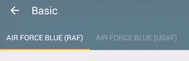
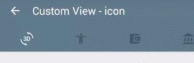

# RecyclerTabLayout
[](https://android-arsenal.com/details/1/2220)

An efficient TabLayout library implemented with RecyclerView.

## Features
- Efficient when having many tabs
- Easy setup with ViewPager (same as [TabLayout](http://developer.android.com/intl/ja/reference/android/support/design/widget/TabLayout.html) of Android Design Support Library)
- RTL layout support

## UseCase
- Many tabs layout
- Infinite loop scrolling (imitated)


## Demos







## Samples
<a href="https://play.google.com/store/apps/details?id=com.nshmura.recyclertablayout.demo"></a>

## Getting started
In your build.gradle:

```
repositories {
    jcenter()
}

dependencies {
   compile 'com.nshmura:recyclertablayout:1.5.0'
}
```

Define `RecyclerTabLayout` in xml layout with custom attributes.
```xml
<com.nshmura.recyclertablayout.RecyclerTabLayout
        android:id="@+id/recycler_tab_layout"
        android:layout_width="match_parent"
        android:layout_height="48dp"
        rtl_tabIndicatorColor="?attr/colorAccent"
        rtl_tabIndicatorHeight="2dp"
        rtl_tabBackground="?attr/selectableItemBackground"
        rtl_tabTextAppearance="@android:style/TextAppearance.Small"
        rtl_tabSelectedTextColor="?android:textColorPrimary"
        rtl_tabMinWidth="72dp"
        rtl_tabMaxWidth="264dp"
        rtl_tabPaddingStart="12dp"
        rtl_tabPaddingTop="0dp"
        rtl_tabPaddingEnd="12dp"
        rtl_tabPaddingBottom="0dp"
        rtl_tabPadding="0dp"/>
```

Set up with the ViewPager.
```java
ViewPager viewPager = (ViewPager) findViewById(R.id.view_pager);
viewPager.setAdapter(adapter);

RecyclerTabLayout recyclerTabLayout = (RecyclerTabLayout) findViewById(R.id.recycler_tab_layout);
recyclerTabLayout.setUpWithViewPager(viewPager);
```

Or set up with ViewPager and Custom RecyclerView.Adapter that's extends `RecyclerTabLayout.Adapter`.
```java
ViewPager viewPager = (ViewPager) findViewById(R.id.view_pager);
viewPager.setAdapter(adapter);

RecyclerTabLayout recyclerTabLayout = (RecyclerTabLayout) findViewById(R.id.recycler_tab_layout);
recyclerTabLayout.setUpWithAdapter(new CustomRecyclerViewAdapter(viewPager));
```

Here's sample of custom RecyclerView adapter.
```java
public class CustomRecyclerViewAdapter extends RecyclerTabLayout.Adapter<CustomRecyclerViewAdapter.ViewHolder> {

    public DemoCustomView01Adapter(ViewPager viewPager) {
        super(viewPager);
        ...
    }

    @Override
    public ViewHolder onCreateViewHolder(ViewGroup parent, int viewType) {
        // Inflate your view.
        View view = ...;
        return new ViewHolder(view);
    }

    @Override
    public void onBindViewHolder(ViewHolder holder, int position) {
        // Bind data
        ...
        
        if (position == getCurrentIndicatorPosition()) {
            //Highlight view
        }
    }

    public class ViewHolder extends RecyclerView.ViewHolder {
        ...
        
        public ViewHolder(View itemView) {
            super(itemView);
        ...
        }
    }
}
```


## Attributes
| attr  | description |
| ------------- | ------------- |
| rtl_tabIndicatorColor    | Indicator color |
| rtl_tabIndicatorHeight   | Indicator height | 
| rtl_tabBackground        | Background drawable of each tab |
| rtl_tabTextAppearance    | TextAppearence of each tab |
| rtl_tabSelectedTextColor | Text color of selected tab |
| rtl_tabOnScreenLimit     | The number of OnScreen tabs. If this value is larger than 0, `rtl_tabMinWidth` and `rtl_tabMaxWidth` are ignored. |
| rtl_tabMinWidth          | Minimum width of each tab |
| rtl_tabMaxWidth          | Maximum width of each tab |
| rtl_tabPaddingStart      | The padding of the start edge of each tab |
| rtl_tabPaddingTop        | The padding of the top edge of each tab  |
| rtl_tabPaddingEnd        | The padding of the end edge of each tab  |
| rtl_tabPaddingBottom     | The padding of the bottom edge of each tab |
| rtl_tabPadding           | The padding of all four edges of each tab |
| rtl_scrollEnabled        | Sets whether tab scrolling is enabled |

[default attribute](library/src/main/res/values/styles.xml)


## Thanks
The demo app uses the following resources.

color-names by codebrainz<br/>
https://github.com/codebrainz/color-names

Material Design icons by Google<br/>
https://github.com/google/material-design-icons

## License
```
Copyright (C) 2017 nshmura

Licensed under the Apache License, Version 2.0 (the "License");
you may not use this file except in compliance with the License.
You may obtain a copy of the License at

http://www.apache.org/licenses/LICENSE-2.0

Unless required by applicable law or agreed to in writing, software
distributed under the License is distributed on an "AS IS" BASIS,
WITHOUT WARRANTIES OR CONDITIONS OF ANY KIND, either express or implied.
See the License for the specific language governing permissions and
limitations under the License.
```
